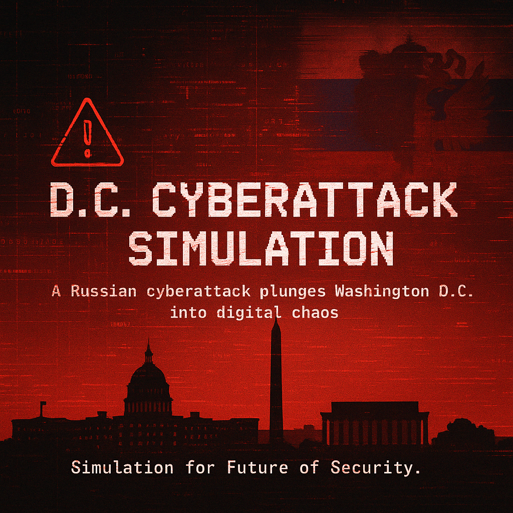

# D.C. Cyberattack Simulation

This simulation is a cyberattack that was conducted by Russia, creating major turmoil in the Washington D.C. area.

Below is a list of resources about the website.

- [GitHub Repository](https://github.com/future-of-security/simulation-template)
- [Markdown Examples](https://github.com/just-the-docs/just-the-docs/blob/main/docs/index-test.md) -> [Generated Page](https://just-the-docs.com/docs/index-test/)
- [GitHub Pages](https://pages.github.com/)
